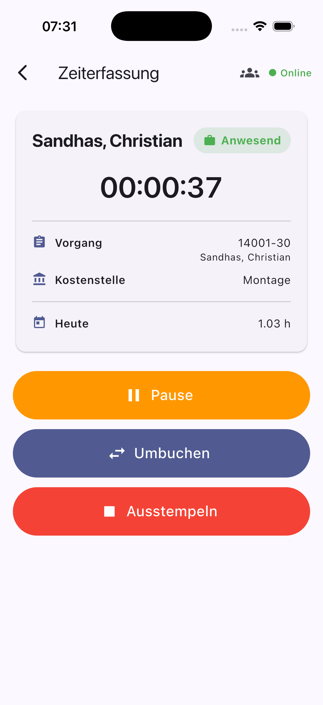

# ApeX Mobile

Flutter-App zur mobilen Zeiterfassung für ein Frappe-/ERPNext-Backend
(Modul `apex.workforce`, Endpunkte unter `apex.workforce.mobile.*`).

Mitarbeiter stempeln sich damit vom Smartphone ein und aus, buchen auf Vorgänge,
Positionen und Kostenstellen um und können Buchungen für ein ganzes Team
(Kolonne) auf einmal auslösen — manuell oder per QR-Code.

<p align="center">
  
</p>

## Funktionen

- **Zeiterfassung** — Einstempeln, Pause/Fortsetzen, Umbuchen, Ausstempeln,
  mit laufender Anzeige der aktuellen Buchungsdauer und der Tagesstunden
- **Buchungs-Assistent** — Auswahl von Vorgang, Position und Kostenstelle,
  inklusive „Zuletzt verwendet"
- **Team / Kolonne** — Zusammenstellung eines Teams (optional mit Gültigkeit
  bis Datum); Aktionen wahlweise nur für sich oder für das ganze Team
- **QR-Scan** — Erfassung über Codes im Format
  `APX:<TYP>[:<Wert>]` mit den Typen `EMP`, `PO`, `POS`, `CC`, `BREAK`/`PAUSE`
  und `END`/`ENDE`
- **GPS** — Standort wird an die Buchung übergeben; die GPS-Pflicht ist über
  das Backend steuerbar (`get_me` → `config.use_gps`)
- **Online-/Offline-Anzeige** — der Server wird periodisch angepingt
- **Sitzung** — Zugangsdaten liegen in Keychain/Keystore
  (`flutter_secure_storage`); bei abgelaufener Session meldet sich der Client
  automatisch neu an und wiederholt die Anfrage

## Aufbau

```
lib/
  main.dart                 App-Einstieg, Theme, Auto-Login
  models/                   Datenmodelle (Status, Team, Lookups)
  screens/                  Login, Startseite, Zeiterfassung,
                            Buchungs-Assistent, Team-Auswahl, QR-Scan
  services/                 Frappe-REST-Client, Zeiterfassung,
                            Standort, Erreichbarkeit, Zugangsdaten
  widgets/                  Wiederverwendbare UI-Bausteine
```

Die App spricht ausschließlich über `/api/method/...` mit dem Server. Der
gesamte HTTP- und Session-Teil steckt in `lib/services/frappe_client.dart`,
die fachlichen Aufrufe in `lib/services/time_tracking_service.dart`.

## Plattformen

Ziel sind **iOS** und **Android**. Die Ordner `macos/` und `web/` sind aus dem
Flutter-Grundgerüst noch vorhanden, aber ungetestet.

App-ID (iOS und Android): `de.sandhasgroup.apexmobileapp`

## Entwicklung

```bash
flutter pub get
flutter run
```

Beim ersten Start werden Server-URL, Benutzername und Passwort abgefragt.

Das iOS-Projekt kommt **ohne CocoaPods** aus — alle Plugins sind Swift
Packages. Es gibt daher bewusst kein `ios/Podfile`.

## Lizenz

Copyright (c) 2026 Christian Sandhas. Alle Rechte vorbehalten.
Der Quellcode ist einsehbar, eine Nutzung oder Weitergabe ist nicht gestattet —
siehe [LICENSE](LICENSE).
